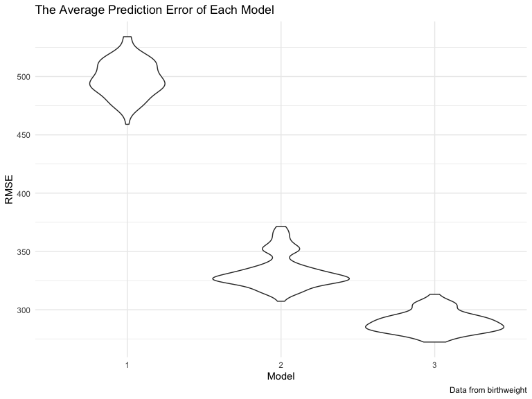

p8105\_hw6\_wq2161
================
Wanxin Qi
11/29/2021

## Problem 1

Load and clean the data for regression analysis.

``` r
birthweight = read_csv("data/birthweight.csv")

# Check for missing data
sum(is.na(birthweight))
```

    ## [1] 0

``` r
birthweight = birthweight %>%
  janitor::clean_names() %>%
  mutate(
    babysex = recode(babysex, `1` = "male", `2` = "female"),
    frace = factor(frace, ordered = FALSE),
    malform = recode(malform, `0` = "absent", `1` = "present"),
    mrace = factor(mrace, ordered = FALSE)
  ) %>%
  relocate(bwt)

birthweight
```

    ## # A tibble: 4,342 × 20
    ##      bwt babysex bhead blength delwt fincome frace gaweeks malform menarche
    ##    <dbl> <chr>   <dbl>   <dbl> <dbl>   <dbl> <fct>   <dbl> <chr>      <dbl>
    ##  1  3629 female     34      51   177      35 1        39.9 absent        13
    ##  2  3062 male       34      48   156      65 2        25.9 absent        14
    ##  3  3345 female     36      50   148      85 1        39.9 absent        12
    ##  4  3062 male       34      52   157      55 1        40   absent        14
    ##  5  3374 female     34      52   156       5 1        41.6 absent        13
    ##  6  3374 male       33      52   129      55 1        40.7 absent        12
    ##  7  2523 female     33      46   126      96 2        40.3 absent        14
    ##  8  2778 female     33      49   140       5 1        37.4 absent        12
    ##  9  3515 male       36      52   146      85 1        40.3 absent        11
    ## 10  3459 male       33      50   169      75 2        40.7 absent        12
    ## # … with 4,332 more rows, and 10 more variables: mheight <dbl>, momage <dbl>,
    ## #   mrace <fct>, parity <dbl>, pnumlbw <dbl>, pnumsga <dbl>, ppbmi <dbl>,
    ## #   ppwt <dbl>, smoken <dbl>, wtgain <dbl>

Propose a regression model for birthweight.

``` r
model_1 = lm(bwt ~ babysex + wtgain, data = birthweight)

birthweight %>% 
  add_residuals(model_1) %>% 
  add_predictions(model_1) %>%
  ggplot(aes(x = pred, y = resid)) + 
  geom_point(alpha = 0.5) +
  geom_abline(slope = 0, intercept = 0, color = "red") +
  labs(
    title = "Model 1 Residuals Against Fitted Values",
    x = "Fitted Values",
    y = "Residuals",
    caption = "Data From birthweight"
  )
```


I made this model by hypothesizing that birth weight is associated with
baby’s sex and mother’s weight gain during pregnancy.

Compare the model to two others.

``` r
model_2 = lm(bwt ~ blength + gaweeks, data = birthweight)

model_3 = lm(bwt ~ bhead + blength + babysex + bhead * blength + bhead * babysex + blength * babysex + bhead * blength * babysex, data = birthweight)

cv_df = crossv_mc(birthweight, 100)

cv_df =
  cv_df %>%
   mutate(
    train = map(train, as_tibble),
    test = map(test, as_tibble))

cv_df = 
  cv_df %>% 
  mutate(
    mod_1 = map(train, ~lm(bwt ~ babysex + wtgain, data = .x)),
    mod_2 = map(train, ~lm(bwt ~ blength + gaweeks, data = .x)),
    mod_3 = map(train, ~lm(bwt ~ bhead + blength + babysex + bhead * blength + bhead * babysex + blength * babysex + bhead * blength * babysex, data = as_tibble(.x)))) %>% 
  mutate(
    rmse_1 = map2_dbl(mod_1, test, ~rmse(model = .x, data = .y)),
    rmse_2 = map2_dbl(mod_2, test, ~rmse(model = .x, data = .y)),
    rmse_3 = map2_dbl(mod_3, test, ~rmse(model = .x, data = .y)))

cv_df %>% 
  select(starts_with("rmse")) %>% 
  pivot_longer(
    everything(),
    names_to = "model", 
    values_to = "rmse",
    names_prefix = "rmse_") %>% 
  mutate(model = fct_inorder(model)) %>% 
  ggplot(aes(x = model, y = rmse)) + 
  geom_violin() +
  labs(
    title = "The Average Prediction Error of Each Model",
    x = "Model",
    y = "RMSE",
    caption = "Data from birthweight"
  )
```



## Problem 2
