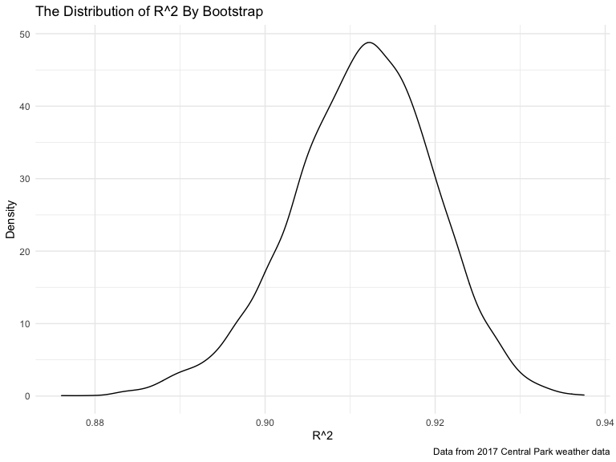
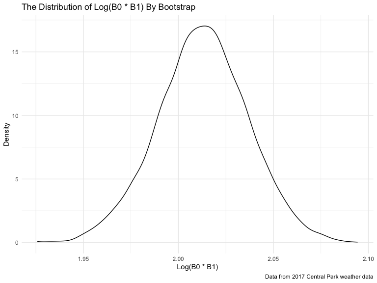

p8105\_hw6\_wq2161
================
Wanxin Qi
11/29/2021

## Problem 1

Load and clean the data for regression analysis.

``` r
birthweight = read_csv("data/birthweight.csv")

# Check for missing data
sum(is.na(birthweight))
```

    ## [1] 0

``` r
birthweight = birthweight %>%
  janitor::clean_names() %>%
  mutate(
    babysex = recode(babysex, `1` = "male", `2` = "female"),
    frace = factor(frace, ordered = FALSE),
    malform = recode(malform, `0` = "absent", `1` = "present"),
    mrace = factor(mrace, ordered = FALSE)
  ) %>%
  relocate(bwt)
```

Propose a regression model for birthweight.

``` r
model_1 = lm(bwt ~ babysex + wtgain, data = birthweight)

birthweight %>% 
  add_residuals(model_1) %>% 
  add_predictions(model_1) %>%
  ggplot(aes(x = pred, y = resid)) + 
  geom_point(alpha = 0.5) +
  geom_abline(slope = 0, intercept = 0, color = "red") +
  labs(
    title = "Model 1 Residuals Against Fitted Values",
    x = "Fitted Values",
    y = "Residuals",
    caption = "Data from birthweight"
  )
```


I made this model by hypothesizing that birth weight is associated with
baby’s sex and mother’s weight gain during pregnancy.

Compare the model to two others.

``` r
model_2 = lm(bwt ~ blength + gaweeks, data = birthweight)

model_3 = lm(bwt ~ bhead + blength + babysex + bhead * blength + bhead * babysex + blength * babysex + bhead * blength * babysex, data = birthweight)

cv_df = 
  crossv_mc(birthweight, 100) %>%
  mutate(
    train = map(train, as_tibble),
    test = map(test, as_tibble))

cv_df = 
  cv_df %>% 
  mutate(
    mod_1 = map(.x = train, ~lm(bwt ~ babysex + wtgain, data = .x)),
    mod_2 = map(.x = train, ~lm(bwt ~ blength + gaweeks, data = .x)),
    mod_3 = map(.x = train, ~lm(bwt ~ bhead + blength + babysex + bhead * blength + bhead * babysex + blength * babysex + bhead * blength * babysex, data = .x))) %>% 
  mutate(
    rmse_1 = map2_dbl(.x = mod_1, .y = test, ~rmse(model = .x, data = .y)),
    rmse_2 = map2_dbl(.x = mod_2, .y = test, ~rmse(model = .x, data = .y)),
    rmse_3 = map2_dbl(.x = mod_3, .y = test, ~rmse(model = .x, data = .y)))

cv_df %>% 
  select(starts_with("rmse")) %>% 
  pivot_longer(
    everything(),
    names_to = "model", 
    values_to = "rmse",
    names_prefix = "rmse_") %>% 
  mutate(model = fct_inorder(model)) %>% 
  ggplot(aes(x = model, y = rmse)) + 
  geom_violin() +
  labs(
    title = "The Average Prediction Error of Each Model",
    x = "Model",
    y = "RMSE",
    caption = "Data from birthweight"
  )
```


## Problem 2

Load the 2017 Central Park weather data.

``` r
weather_df = 
  rnoaa::meteo_pull_monitors(
    c("USW00094728"),
    var = c("PRCP", "TMIN", "TMAX"), 
    date_min = "2017-01-01",
    date_max = "2017-12-31") %>%
  mutate(
    name = recode(id, USW00094728 = "CentralPark_NY"),
    tmin = tmin / 10,
    tmax = tmax / 10) %>%
  select(name, id, everything())
```

Use 5000 bootstrap samples and, for each bootstrap sample, produce
estimates of r̂2 and log(β̂0∗β̂1). Plot the distribution of your estimates,
and describe these in words.

``` r
bootstrap_rsquared =
  weather_df %>% 
  modelr::bootstrap(n = 5000) %>% 
  mutate(
    models = map(strap, ~lm(tmax ~ tmin, data = .x) ),
    results = map(models, broom::glance)) %>% 
  select(-strap, -models) %>% 
  unnest(results) %>%
  select(.id, r.squared)

bootstrap_rsquared %>%
  ggplot(aes(r.squared)) +
  geom_density() +
  labs(
    title = "The Distribution of R^2 By Bootstrap",
    x = "R^2",
    y = "Density",
    caption = "Data from 2017 Central Park weather data"
  )
```



``` r
bootstrap_log_betas =
  weather_df %>%
  modelr::bootstrap(n = 5000) %>% 
  mutate(
    models = map(strap, ~lm(tmax ~ tmin, data = .x) ),
    results = map(models, broom::tidy)) %>% 
  select(-strap, -models) %>% 
  unnest(results) %>%
  select(.id, term, estimate) %>%
  pivot_wider(
    names_from = "term",
    values_from = "estimate"
  ) %>%
  mutate(
    log_betas = log(`(Intercept)` * tmin)
  )

bootstrap_log_betas %>%
  ggplot(aes(log_betas)) +
  geom_density() +
  labs(
    title = "The Distribution of Log(B0 * B1) By Bootstrap",
    x = "Log(B0 * B1)",
    y = "Density",
    caption = "Data from 2017 Central Park weather data"
  )
```



The distribution of r.squared is approximately normal but moderately
left skewed with the highest density between r.squared = 0.91 and 0.92.
By the definition of r.squared, the model fits the data well. The
distribution of log(beta0 \* beta1) is approximately normal with the
highest density between log(beta0 \* beta1) = 2.00 and 2.025. The
skewness is less obvious than that of r.squared. To improve the
distribution plot, we could try more bootstrap samples.

Using the 5000 bootstrap estimates, identify the 2.5% and 97.5%
quantiles to provide a 95% confidence interval for r̂2 and log(β̂0∗β̂1).

``` r
bootstrap_rsquared %>%
  summarize(
    ci_lower = quantile(r.squared, 0.025), 
    ci_upper = quantile(r.squared, 0.975)
  )
```

    ## # A tibble: 1 × 2
    ##   ci_lower ci_upper
    ##      <dbl>    <dbl>
    ## 1    0.895    0.928

``` r
bootstrap_log_betas %>%
  summarize(
    ci_lower = quantile(log_betas, 0.025), 
    ci_upper = quantile(log_betas, 0.975)
  )
```

    ## # A tibble: 1 × 2
    ##   ci_lower ci_upper
    ##      <dbl>    <dbl>
    ## 1     1.97     2.06
